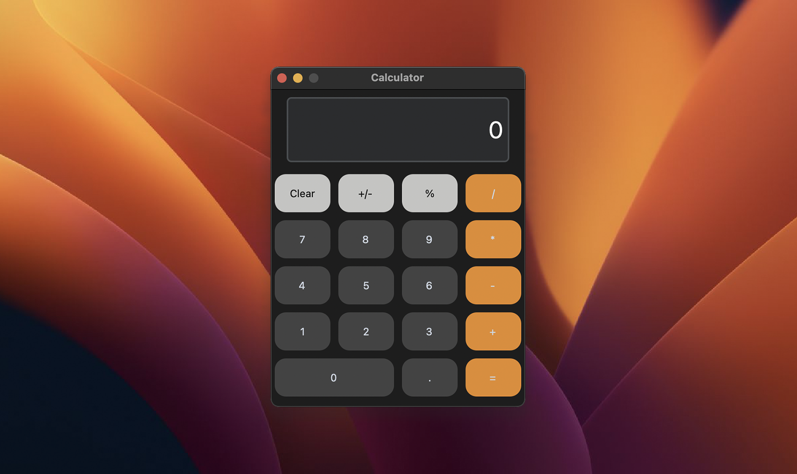

<p align="center">
  <picture>
    <source media="(prefers-color-scheme: dark)" srcset="./documentation_images/App_icon_dark.png">
    
  </picture>
</p>

---
A simple calculator app made using the CustomTKinter package in Python. The application was designed to replicate the iOS calculator app and was built as a practice project to learn customtkinter. 



## Installation
Install the required packages with pip:
```
python -m pip install -r requirements.txt
```
Then run:
```
python3 main.py
```

---
Go check out the official repo for [CustomTKinter](https://github.com/TomSchimansky/CustomTkinter#readme) and see what else the package can do.
